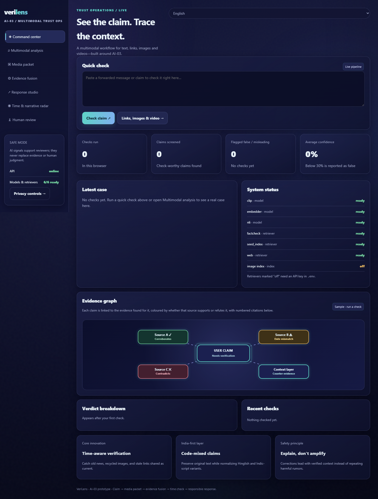
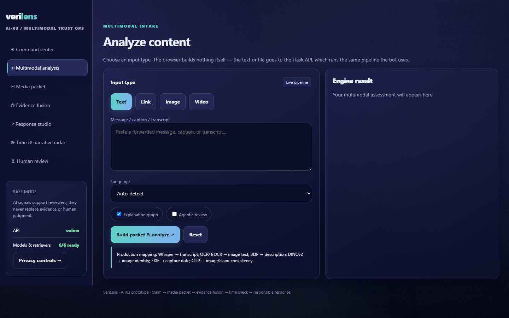
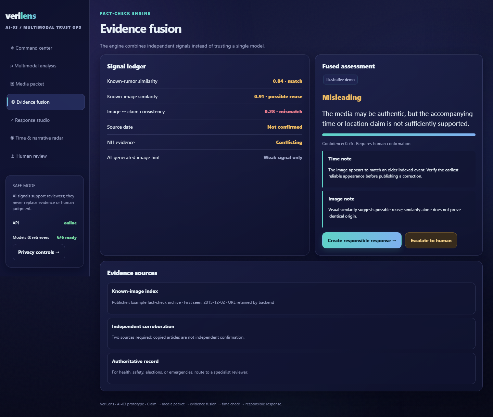
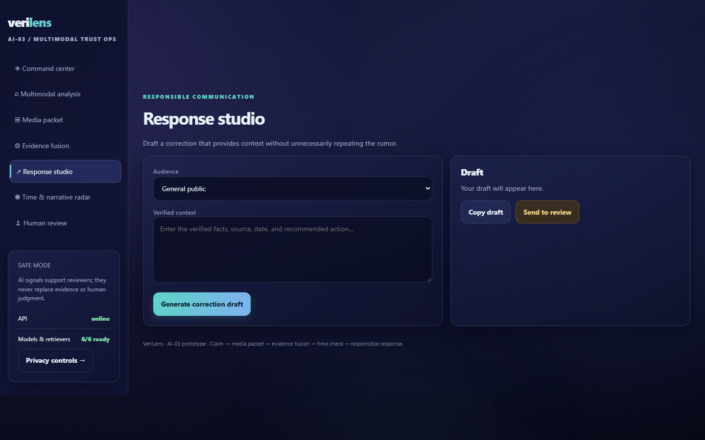
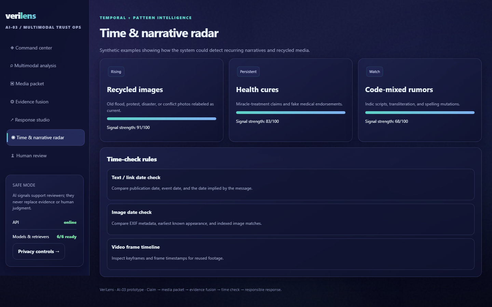
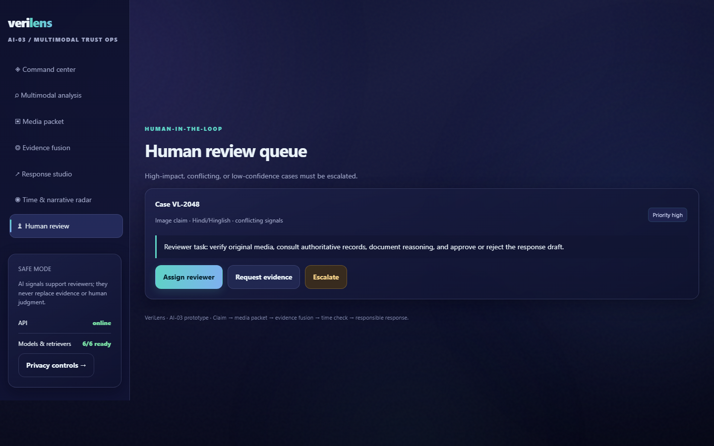

# Misinfo Checker

## Live video

https://github.com/virajshah744-code/misinfo-checker/blob/master/demo/verilense_demo.mp4

## Screenshots

The seven views of the web client.
Full-size images and notes on how they were taken are in
[`screenshots/`](screenshots/README.md).

| Command center | Multimodal analysis |
|---|---|
|  |  |
| **Media packet** | **Evidence fusion** |
|  |  |
| **Response studio** | **Time & narrative radar** |
|  |  |
| **Human review** | |
|  | |

---

A misinformation detection service for forwarded text, links, images and videos —
the kind of content that circulates on WhatsApp/Telegram in India (fake UPI cashback
offers, Hinglish rumours, recycled disaster footage, health cures).

The system is a staged pipeline. Each stage produces a typed object that the next
stage consumes, so stages can be built, tested and swapped independently.

```
 input ──► [1] Ingest ──► MediaPacket ──► [2] Claim Extraction ──► ClaimSet
                    │                                                  │
                    │              to_graph_seed() + images            ▼
                    └──────────────────────────────► [3a] Evidence Graph
                                                       ▲    ▲    ▲   │
                    [3b] Retrieval ────────────────────┘    │    │   │
                    (fact-check / web / seed index)         │    │   │
                    [5]  Images ────────────────────────────┘    │   │
                    (duplicates, dates, CLIP captions)           │   │
                    [4]  Stance ─────────────────────────────────┘   │
                    (rank -> NLI, ratings override)                  ▼
                                                            Verdict ──► API / bot

 All stages built. Runs with no API keys and no models: the local seed index
 answers offline, and anything it cannot settle comes back `unverified`.
```

See [`PROJECT_STATUS.md`](PROJECT_STATUS.md) for the gap analysis.

---

## Stage 1 — Ingest → `MediaPacket`

`backend/analyzers/packet.py` normalises every input type into one dict:

```python
{
  "input_type": "text" | "link" | "image" | "video",
  "text":        "...",        # raw text / article body / caption + transcript
  "source_date": "2024-06-08" | None,
  "images": [                  # one per image, or one per video keyframe
    {
      "path": "...", "ocr_text": "...", "description": "...",
      "embedding": [768 floats], "exif_date": ..., "ai_generated_score": ...,
      "frame_time": 12.5 | None
    }
  ]
}
```

| Builder | What it does |
|---|---|
| `from_text(text)` | passes text through |
| `from_link(url)` | trafilatura body + htmldate publish date |
| `from_image(path, caption)` | EasyOCR, BLIP caption, DINOv2 embedding, EXIF date, optional AI-image detector |
| `from_video(path, caption)` | ffmpeg → Whisper transcript (merged into `text`), keyframes every 5 s → `from_image` on each |
| `from_video_url(url)` | yt-dlp download → `from_video` |

Model loading lives in `backend/analyzers/models.py` (all lazy, `lru_cache`d).

## Stage 2 — Claim Extraction → `ClaimSet`

`backend/claims/` turns a packet into separate, structured, check-worthy claims.

```python
from backend.claims import extract_claims

claims = extract_claims(packet)                       # backend="auto"
claims = extract_claims(packet, backend="heuristic")  # regex only, no models
claims = extract_claims(packet, backend="transformer")# require the HF models

claims.check_worthy()                    # only the ones worth fact-checking
claims.to_graph_seed()                   # {"nodes": [...], "edges": [...]}
claims.model_dump(mode="json")           # serialisable
claims.backend                           # which backend actually ran
```

Two backends share the same schema and pipeline; `auto` (the default) picks
`transformer` when `transformers` + `torch` import, else `heuristic`.

| Step | `heuristic` | `transformer` |
|---|---|---|
| Sentence split | regex | regex |
| Patterned entities (money, %, dates, URL, phone, UPI) | regex | regex |
| Named entities (PERSON / ORG / GPE) | capitalisation + keyword hints | **HF token-classification NER**, merged with regex; regex guesses kept only where the model found nothing |
| Check-worthy score | feature→weight table | **0.5 × heuristic + 0.5 × zero-shot NLI** P("a factual claim that can be verified") |
| Claim type | rule order | **zero-shot NLI over the 10 types**, used when top-2 margin ≥ 0.10; `chain_offer` and `health` from the rules are sticky (their regex cues are more precise) |
| Hard rejects (greeting, < 4 tokens) | yes | yes — the model is never called for these |

Models (lazy-loaded, `lru_cache`d, CPU is fine — ~1.2 GB download on first use):

| Env var | Default | Notes |
|---|---|---|
| `CLAIM_NER_MODEL` | `dslim/bert-base-NER` | English. Try `ai4bharat/IndicNER` for Hindi / Hinglish names |
| `CLAIM_ZSC_MODEL` | `MoritzLaurer/mDeBERTa-v3-base-mnli-xnli` | Multilingual NLI, covers Hindi |

Each claim's `signals` records both sides (`heuristic_confidence`, `model_worthy`,
`heuristic_type`, `model_type`, `model_type_margin`) so the two backends can be
compared on the same input, and `dropped` reasons include `model_not_claim` when the
model demoted a sentence the rules had accepted.

### Pipeline

1. **Segment** every text-bearing field — `text`, each image's `ocr_text`, each image's
   `description` — into sentences, keeping char offsets, image index and frame time
   (`segment.py`).
2. **Extract entities and time references** with regex: money (with lakh/crore
   normalisation), percentages, numbers, dates (absolute → ISO, relative → resolved
   against `today`, recurring), URLs, phone numbers, UPI IDs, hashtags, and
   capitalised proper-noun spans typed as ORG / GPE / PERSON / PROPER (`entities.py`).
3. **Score check-worthiness** from a transparent feature → weight table: named entities,
   quantities, time refs, attribution verbs, policy/health/event vocabulary and
   chain-offer vocabulary push a sentence up; questions, opinion markers, personal chat,
   greetings and bare imperatives push it down. Threshold 0.45 (`checkworthy.py`).
4. **Classify** each claim into one type: `chain_offer`, `health`, `policy`,
   `attribution`, `money`, `statistic`, `event`, `causal`, `prediction`, `generic`.
   Attribution claims also get `attributed_to` (the speaker).
5. **Dedupe** near-identical sentences across fields (OCR text frequently repeats the
   caption) with token Jaccard ≥ 0.8, keeping the `text` copy first.
6. Rejected sentences are kept in `ClaimSet.dropped` with a reason
   (`question`, `opinion`, `personal`, `greeting`, `too_short`, `low_signal`, …)
   so the evaluation harness can tune the weights later.

### Claim shape

```python
Claim(
  id="clm_…",                       # stable sha1 of packet + normalised text
  text="You have won Rs 5,000 cashback from SBI.",
  normalized_text="you have won rs 5 000 cashback from sbi",
  claim_type="chain_offer",
  confidence=0.9,
  check_worthy=True,
  entities=[Entity(label="MONEY", text="Rs 5,000", normalized="INR 5000", …),
            Entity(label="ORG",   text="SBI",      normalized="sbi", …)],
  time_refs=[TimeRef(kind="relative", text="today", normalized="2026-09-17", …)],
  numbers=["INR 5000"],
  attributed_to=None,
  source=SourceSpan(field="text" | "ocr" | "caption", image_index=…, frame_time=…, start=…, end=…),
  language="en" | "hi" | "hinglish",
  signals={…},                      # the feature flags that produced the score
  evidence_ids=[], verdict=None,    # reserved for stages 3–4
)
```

### Evidence-graph seed

`ClaimSet.to_graph_seed()` emits the skeleton the evidence graph will grow from:

- nodes: one `packet`, one per `claim`, one per unique `entity`
- edges: `packet -HAS_CLAIM-> claim`, `claim -MENTIONS-> entity`,
  `claim -SHARES_ENTITY-> claim` (via a common entity id)

Stage 3a grows `image`, `evidence`, `source`, `date` and `verdict` nodes on top of this
seed without touching this module; ids are deterministic, so the same input always
yields the same graph.

### Why keep the heuristic layer under the model

The regex layer is not just a fallback: models are unreliable on UPI ids, `Rs 2 lakh
crore`, `15/08/2023`, phone numbers and forward-this-message patterns, so those come
from patterns in both backends. The model adds what regex cannot do — recognising
names without capitalisation cues, judging whether a sentence is a verifiable claim
rather than chit-chat, and typing claims in Hindi/Hinglish.

Known limits: the default NER model is English-only (swap `CLAIM_NER_MODEL` for Indic
text); zero-shot typing is ~0.3 s per sentence on CPU, so long articles are slow —
batching is the obvious next optimisation.
## Stage 3a — Evidence Graph

`backend/graph/` holds everything the pipeline learns about one message in a single
NetworkX `MultiDiGraph`: the packet, its claims, the entities they name, the images that
came with them, the evidence retrieved about them, where that evidence came from, the
dates involved, and the verdict reached.

```python
from backend.claims import extract_claims
from backend.graph import EvidenceGraph

claims = extract_claims(packet)
graph  = EvidenceGraph.from_claimset(claims, packet)

graph.add_evidence(claim_id, candidate)                                # stage 3b
graph.set_stance(evidence_id, claim_id, "refutes", score=0.9)          # stage 4
graph.add_duplicate(image_node, evidence_id, first_seen="2015-12-02")  # stage 5
graph.flag_date_mismatch(image_node, "2015-12-02")

graph.stance_totals(claim_id)     # weighted support vs refutation
graph.decisive_hits()             # fact-checks that settle a claim outright
graph.open_claims()               # nothing has taken a side on these yet
graph.timeline()                  # every date the graph knows, oldest first
graph.summary(1200)               # what a bot reply can quote
graph.to_json() / EvidenceGraph.from_json(...)
graph.export_html("graph.html")   # pyvis, for a demo
```

`from_claimset` consumes stage 2's `to_graph_seed()` rather than re-deriving claims and
entities, then adds an `image` node per picture or keyframe — carrying its EXIF date,
frame time and AI-generated score — and links any claim that was read *out of* an image
(OCR text or a generated caption) back to it.

| Node | From |
|---|---|
| `packet` | stage 1 |
| `claim`, `entity` | stage 2 |
| `image` | stage 1, added by stage 3a |
| `evidence` | stages 3b / 5 |
| `source` | stage 3b (one per publisher domain) |
| `date` | shared by everything with a date |
| `verdict` | the verdict stage |

```
packet   -HAS_CLAIM->      claim          claim    -HAS_EVIDENCE->  evidence
claim    -MENTIONS->       entity         evidence -FROM_SOURCE->   source
claim    -SHARES_ENTITY->  claim          evidence -PUBLISHED_ON->  date
packet   -HAS_IMAGE->      image          evidence -SUPPORTS->      claim
claim    -EXTRACTED_FROM-> image          evidence -REFUTES->       claim
image    -CAPTURED_ON->    date           evidence -NEUTRAL->       claim
image    -DUPLICATE_OF->   evidence       claim    -HAS_VERDICT->   verdict
image    -FIRST_SEEN_ON->  date
image    -DATE_MISMATCH->  date
```

Why a multigraph: two nodes are often joined for more than one reason at once — an image
is both `DUPLICATE_OF` an older post and `FIRST_SEEN_ON` that post's date, and two claims
can share three different entities. Edges are keyed by type (and by `via` for
`SHARES_ENTITY`), which is also what makes every `add_*` **idempotent**: re-running
retrieval updates edges in place instead of stacking copies of them. Ids are
content-derived, so the same input rebuilds the same graph.

**No embeddings are stored.** Vectors belong to the index that searches them; putting
them in the graph would multiply a serialised graph's size by a thousand and push a float
array into every bot reply.

`stance_totals` is what a verdict thresholds on: each item contributes
`stance score × source credibility`, so one PIB fact-check outweighs three blogs.

## Stage 3b — Evidence Retrieval

`backend/evidence/` finds things that bear on each check-worthy claim. It **retrieves and
normalises but does not judge** — every candidate leaves with `stance=None`, and stage 4
reads the text and decides. A retriever that also guessed at stance would bury that guess
inside a relevance score, where nothing could audit it.

```python
from backend.evidence import collect_evidence

report = collect_evidence(claimset, graph)   # writes evidence nodes into the graph
```

### Queries (`queries.py`)

Two or three per claim, because the useful question depends on the kind of claim:

1. **verbatim** — the claim itself, for a semantic index;
2. **keywords** — its entities, numbers and resolved dates, for a keyword engine that
   would drown in a full sentence;
3. **routed** — scoped by `claim_type` to the sources that can actually settle it.

| `claim_type` | Routed to |
|---|---|
| `chain_offer` | fact-checkers + PIB Fact Check, with "scam / fake / fact check" |
| `health` | WHO, ICMR, MoHFW + fact-checkers |
| `policy`, `money` | pib.gov.in, rbi.org.in, npci.org.in |
| `event`, `prediction` | news, recent |
| `attribution` | the speaker and the quote |

Hindi and Hinglish claims get their routed query in Hindi as well: the Indian fact-check
corpus is substantially Hindi, and the English query alone will not reach it.

### Retrievers (`retrievers/`)

| Module | Source | Key | Without the key |
|---|---|---|---|
| `factcheck.py` | Google Fact Check Tools, `en` + `hi` | `GOOGLE_FACTCHECK_KEY` | logs once, returns `[]` |
| `web.py` | Tavily, scoped by `include_domains` | `TAVILY_API_KEY` | logs once, returns `[]` |
| `seed_index.py` | local FAISS index over `data/seed_factchecks.jsonl` | none | **works offline** |

The seed index is what makes the demo runnable with no keys at all. It embeds 32 known
Indian rumours with `paraphrase-multilingual-MiniLM-L12-v2` — reached through
`backend.stance.rank.embedder()`, the same `lru_cache`d loader stage 4 uses, so the model
is in memory once — and answers a claim with the closest entries above a similarity
floor. Being multilingual, a Devanagari claim matches an English entry: measured live,
"गर्म पानी पीने से कोरोना ठीक होता है" retrieves the English hot-water debunk at 0.48,
and the SBI cashback forward matches its entry at 0.82 while unrelated personal chat
matches nothing. FAISS is optional; without it the same vectors are compared with NumPy.

### Romanised Hindi (`translit.py`)

The embedder reads Devanagari and English; it does not read the Latin-script Hindi that
most WhatsApp forwards are actually written in. So a query is offered to `translit.py`
before it is embedded, and when — and only when — it really looks like romanised Hindi,
a Devanagari rewriting comes back. The seed index then embeds both spellings and scores
each entry on whichever matches it better.

    garam paani peene se corona theek ho jata hai
    → गरम पानी पीने से कोरोना ठीक हो जाता है        0.32 → 0.52 against the debunk

The mapping is a ~330-word lexicon keyed by a folded spelling (`paani`/`pani`,
`theek`/`thik`, `zaroor`/`jaroor` all collapse to one key), not a transliteration scheme
like ITRANS — those are lossless and expect `paanii`, which nobody types. A lexicon can
only ever change words it has been told about, which is what a retrieval-critical
component needs: there is no rule engine that can quietly mangle an English sentence.

Three-way split decides what opens the gate. Native Hindi (`HINDI`) counts; English
loanwords Hindi has absorbed (`LOANWORDS`: bank, laptop, doctor) and Hindi words spelled
like English ones (`AMBIGUOUS`: "to", "the", "me") are rewritten once it is open but
never help open it — otherwise "Please send me the meeting notes" would read as Hindi.
An English or Devanagari query gets one spelling and one vector, so **its score is
arithmetically identical to what it was before this module existed**, and the 0.45 floor
never moved.

**All 32 entries are demo data.** Each carries `"demo": true` and a `demo_note`, their
URLs point at `example-demo.invalid`, matches stay marked `demo` all the way through, and
a verdict resting only on them says so and is discounted.

### Normalisation (`normalize.py`)

- **ratings** collapse to `false` / `misleading` / `true` / `unknown`, with the
  publisher's exact words kept in `rating_raw`. Mixed verdicts are matched first, so
  "half true" does not read as "true" and "partly false" does not read as "false";
- **domains** get a credibility weight from `config/sources.yaml` — IFCN fact-checkers
  and PIB 1.0, government 0.9, established news 0.8, unknown 0.5, blogs and social 0.3 —
  and a subdomain inherits its parent's tier;
- **duplicates** collapse by canonical URL (tracking parameters, `www.`, `/amp`, the
  fragment and the scheme all normalised away), and the surviving copy inherits what the
  others knew — a body from the web hit, a rating from the fact-check API;
- **`decisive`** is set here and nowhere else: a fact-check, rated false or misleading,
  by a publisher weighted ≥ 0.9, whose text overlaps the claim enough that the rating is
  plainly about *this* claim.

`fetch.py` then pulls full article text for the top few results with trafilatura, because
the sentence that refutes a claim is usually in the third paragraph, not the search
snippet.

## Stage 4 — Stance

`backend/stance/` decides what each retrieved item *says about* the claim it was
retrieved for.

First it asks a question retrieval does not answer — **is this evidence about this claim
at all?**

```
claim -> retrieve -> [ is the evidence about this claim? ] -> NLI -> rating -> verdict
                           no -> neutral, rating withheld
```

Retrieval returns the hot-water-cures-COVID debunk for "boiling water before drinking it
reduces the risk of waterborne disease", and it is right to: both sentences are about
drinking water. Letting that debunk's `false` rating settle the claim is what was wrong,
and it is the worst thing this system can do (DECISIONS.md O6). So `backend/aboutness.py`
compares the claim with the claim the fact-check *says it reviews* — lexically, on
stemmed content words, deliberately independent of the embedding that retrieved it, since
the failure being fixed is an embedding being confidently wrong. Neither text accounting
for half of the other means one topic and two different assertions inside it: the
evidence is neutral with `method="not_about"`, its rating is withheld, and it never
reaches either model. Across languages, where word overlap measures loanwords rather than
claims, the gate abstains instead of guessing.

Documents that pass are chunked into 2–3 sentence passages, ranked against the claim
by the multilingual embedder, and the top few go to the NLI model in one batch:

```
premise    = a passage of the evidence
hypothesis = the claim under test
```

entailment → `support`, contradiction → `refute`, and the strongest non-neutral verdict
across a document wins. A document whose best passage falls below the 0.3 relevance
cutoff is off-topic and never reaches the model at all.

Two rules sit on top:

- **A publisher's rating beats the text.** Fact-check articles quote the false claim in
  their headline and lead, so an entailment model frequently reads them as *support*.
  When a source states a rating, that rating decides — and the support-vs-refute conflict
  is flagged `misleading`, so a verdict can say why it ignored the text.
- **Nothing raises.** A missing model, a failed download or an empty document all come
  back neutral with `method="unavailable"`.
- **A rating cannot settle a claim the evidence is not about.** The aboutness gate above
  applies to rated items only, because a rating is the one thing that decides a stance
  without anything having scored it.

The NLI model is the same mDeBERTa checkpoint stage 2 uses for zero-shot typing, reached
through that stage's cached pipeline — one set of weights in memory, not two.

`graph_adapter.apply_stances(graph)` is stage 4's only contact with the graph: it reads
each claim's evidence, classifies it, and writes SUPPORTS / REFUTES / NEUTRAL edges
carrying the score, the relevance, the deciding passage and the method. Re-running
replaces a stance rather than stacking a second one beside it.

## Stage 5 — Image Evidence

`backend/images/` **reuses what stage 1 already computed** — the DINOv2 embedding, the
BLIP description, the OCR text, the EXIF date, the AI-generated score, the frame time.
None of it is recomputed. Three checks:

| Module | Question | Finding |
|---|---|---|
| `keyframes.py` | is this frame new? | drops frames with DINOv2 cosine > 0.95 to one already kept; caps a packet at 8 |
| `local_index.py` | have we seen this picture before? | `DUPLICATE_OF` + `FIRST_SEEN_ON`, and `DATE_MISMATCH` when it predates the message by > 30 days |
| `reverse_search.py` | where else has it appeared? | the same, from SerpAPI Google Lens (`SERPAPI_KEY`) |
| `consistency.py` | does the picture show what the claim says? | a `refutes` edge with `method="clip"` and the `misleading` flag |

The commonest visual misinformation is not a forgery but a real photograph with a false
caption, so `consistency.py` scores the pairing directly with CLIP — `clip-ViT-B-32` for
the image and `clip-ViT-B-32-multilingual-v1` for the text, so a Hindi claim is scorable
against an English-trained image encoder. Below `CLIP_MIN_SIMILARITY` (default 0.2) the
picture becomes evidence *against* the claim.

An unavailable model produces **no finding**, never a false accusation: telling someone a
truthful caption is miscaptioned is worse than staying quiet.

One picture produces one date-mismatch finding, from the *earliest* match — a photograph
that matches three archive entries has not been recycled three times, and the oldest
appearance is the one that matters.

The image index is built by `scripts/build_image_index.py`, which generates marked
placeholder images when there is nothing real to index. They are seeded noise textures
rather than flat cards for a measured reason: distinct flat cards embed at up to 0.95
cosine and produced false matches, while the noise variant peaks at 0.94 and the *same*
picture recompressed as JPEG scores 0.98 — so the 0.95 floor sits in a real gap.

## Verdict

`backend/verdict.py` turns the graph into a label by rules, not a model, because a
verdict that cannot be explained is not worth giving. The order *is* the design:

1. **A decisive fact-check wins outright** — a publisher who checked *this* claim has
   done the work properly, and no weighted sum of loosely-related articles should be able
   to outvote it.
2. **A recycled picture makes the claim misleading**, even when the sentence is
   defensible. "Floods in Chennai" over a 2015 photograph is misinformation about today.
3. **Otherwise weighted stance decides**, and only when one side clearly outweighs the
   other (≥ 0.5 absolute, ≥ 2× the other side). Anything closer is `disputed`.
4. **Nothing found is `unverified`** — the honest answer for most forwards. A system that
   guesses "false" because it found nothing is a system that cries wolf, and the fastest
   way to make people stop reading the warnings. When the only thing found was a
   fact-check of a *different* claim, the reply says so — and says it without repeating
   that fact-check's rating, which beside this claim would be the accusation in prose.

Labels: `false`, `misleading`, `true`, `disputed`, `unverified`. Every verdict carries the
specific evidence that produced it, and a packet takes the worst label among its claims.

## The pipeline

```python
from backend.pipeline import analyze_text

result = analyze_text("SBI is giving Rs 5,000 cashback, forward to 10 people")

result["verdict"]["label"]      # false / misleading / true / disputed / unverified
result["verdict"]["summary"]    # one sentence a bot can send back
result["verdict"]["claims"]     # per claim: label, confidence, reasons, evidence ids
result["timeline"]              # every date the graph knows, oldest first
result["stages"]                # what each stage did, and how long it took
```

`analyze`, `analyze_text`, `analyze_link`, `analyze_image`, `analyze_video`. Images run
*before* stance, so the CLIP finding is in front of the stance pass rather than needing a
second one. Every stage is optional and every stage fails soft: with no keys and no
models this still returns a well-formed result, with `unverified` for anything it cannot
settle. The pipeline degrades, it does not break.

## Agent layer

An optional coordinator *on top of* stages 1–5, not a replacement for them. The linear
pipeline always runs the same six stages in the same order; the agent layer decides what
is worth running for **this** message, lets each specialist abstain, and sends retrieval
back out when a claim is left open.

```python
from backend.agents import run_agentic

result = run_agentic(packet)              # same shape as pipeline.analyze
result["verdict"]["label"]                # the same five labels, same rules
result["explanation"]["explanation"]      # one or two evidence-based sentences
result["agents"]["results"]["evidence"]["status"]   # ok / abstained / skipped / failed
```

`analyze(..., agentic=True)` and `POST /check/text?agentic=true` are the same thing
through the existing entry points.

Six agents, one job each:

| Agent | Decides | Tools it reaches for |
|---|---|---|
| `orchestrator` | the route, the shared graph, handoffs, when to stop | `graph.build` |
| `claim` | which claims are worth the retrieval budget | `claims.extract` |
| `evidence` | which retrievers to ask, and whether one pass was enough | `evidence.collect`, `evidence.{factcheck,seed_index,web}`, `evidence.fetch_text`, `evidence.attach`, `graph.open_claims` |
| `media` | whether there is media worth checking, and with which checks | `images.keyframes`, `images.collect` |
| `verification` | nothing about the label — it assembles and calls the rules | `stance.apply`, `graph.totals`, `graph.decisive`, `verdict.decide` |
| `explanation` | how to say what was found | none, by design |

Every stage function is registered as a **tool** (`backend/agents/tools.py`): a name, a
probe that says whether it can run at all (`factcheck.available()` is false without a
key), and a call straight through to the existing function. No stage logic is duplicated
in this package, and `ToolRegistry.call` returns a record rather than raising, so one
dead retriever cannot take a verdict down.

Every agent returns an `AgentResult` — `status`, `confidence`, structured `data`, its
`tool_calls` — and `status` distinguishes the thing that matters most here:

```
ok         did its job; its data can be used
abstained  ran, found the evidence insufficient, and says so
skipped    not applicable (no media, retrieval switched off)
failed     raised; the exception is in its notes
```

**Abstention is a first-class outcome.** An evidence agent that found nothing has told
you something true; one that guessed would not have. A `verification` abstention is also
the escalation trigger: the first pass asks the precise sources (fact-check API, local
seed index) and holds the broad web search in reserve, and if a claim is still open
afterwards the planner spends the reserve on **just those claims** with wider queries —
one extra round, never two.

Routing is a `Planner`, so the layer is provider- and model-agnostic:

```python
from backend.agents import LLMPlanner, run_agentic

planner = LLMPlanner(complete=lambda prompt: call_your_model(prompt))
result = run_agentic(packet, planner=planner)
```

`complete` is any callable from a prompt to JSON — that is the whole provider contract.
What it returns is validated against the same `Plan` schema, a step naming an unknown
agent is dropped, a route that forgot to verify or explain is completed, and any failure
falls back to `RulePlanner` with the fallback recorded in the trace. `RulePlanner` is
the default and is deterministic, because the offline path has to work: with no keys, no
models and no network, the rules plan the route and a template writes the explanation.
The final explanation accepts a `writer=` callable on the same terms.

The labels do not move. `verification` calls `backend/verdict.py` unchanged, and the
explanation is added as `verdict["explanation"]` *beside* `verdict["summary"]`, never in
place of it — `summary` comes from the rule cascade and is what the bot sends.

## API

There are two front doors onto the same pipeline, because two callers need different
things. They share `backend/api/shape.py`, so a given result is the same JSON at either.

**FastAPI** (`backend/api/main.py`) — what the bot talks to. Media arrives as a *path* to
a file already on the server.

```
GET  /health          which retrievers and models are actually switched on
POST /check/text      {"text": "..."}
POST /check/link      {"url": "https://..."}
POST /check/image     {"path": "...", "caption": "..."}
POST /check/video     {"path": "...", "caption": "..."}
POST /check/packet    a packet built elsewhere
```

**Flask** (`backend/api/flask_app.py`) — what the browser talks to. Same endpoints under
`/api`, and it serves the page itself, which is why there is no CORS configuration
anywhere in the project: the page and the API are one origin.

`GET /` is a Jinja template (`backend/api/templates/index.html`), not the built
`frontend/index.html` handed over as a file. The template is the SPA shell; the server
fills in two things the page would otherwise have to guess at:

* **the bundle.** Vite writes a content hash into every asset name, so the server reads
  the names out of the build at render time. A rebuild changes no Python and no template.
* **`window.__VERILENS__`**, injected before the bundle loads: the API base and the limits
  the API enforces (`maxTextChars`, `maxUploadBytes`). The page refuses an over-long
  message or an oversized file itself rather than waiting for a 413, and the numbers live
  in one place — `flask_app.py` — instead of being copied into JavaScript.

With no bundle in `frontend/`, `/` renders the `npm run build` instructions instead of a
blank root div; the API stays up either way.

```
GET  /                the page (rendered template)
GET  /api/health
POST /api/check/text      {"text": "..."}          JSON or form
POST /api/check/link      {"url": "https://..."}
POST /api/check/image     multipart file + caption  (or {"path": ...})
POST /api/check/video     multipart file + caption  (or {"path": ...})
POST /api/check/packet    a packet built elsewhere
```

A browser has bytes in a form, not a path on the server, so the Flask app accepts a real
upload: it saves it to a temp directory it owns, runs the pipeline over it, and deletes it
in `finally` — including when a stage raises. Uploads are capped at 64 MB, rejected by
Werkzeug before the body is read.

Each returns the verdict, a `results` array with one entry per claim (label, confidence,
explanation, reasons, evidence ids), the packet, the timeline and per-stage timings.
`?graph=true` adds the whole serialised graph. `?agentic=true` runs the same stages
through the agent layer and adds an `agents` block (the plan, each agent's structured
result, the tool trace) plus `explanation`; everything else in the response is
unchanged. A failure *inside* the pipeline is not an HTTP failure: it produces
`unverified` with an explanation, which is a useful answer.

Set `CLAIM_BACKEND=heuristic` for a latency-sensitive deployment — the transformer
backend spends roughly 0.3 s per sentence on CPU.

## The bot

`guardian_bot.process_message(text)` runs the pipeline and returns a reply written for
the person who forwarded the message: what to do first ("Don't forward this — it isn't
true"), then the claim, then *why*, naming the publisher. It says when it does not know,
and it says out loud when it is running on the demo index.

---

## Configuration

Everything is optional. With none of it set, the pipeline runs on the local seed index.

| Variable | What it does |
|---|---|
| `GOOGLE_FACTCHECK_KEY` | Google Fact Check Tools |
| `TAVILY_API_KEY` | Tavily web search |
| `SERPAPI_KEY` | SerpAPI Google Lens reverse image search |
| `CLAIM_BACKEND` | `heuristic` / `transformer` / `ollama` / `auto` |
| `CACHE_DIR`, `CACHE_DISABLED`, `CACHE_TTL_DAYS` | the disk cache (default `cache/`, never expires) |
| `SOURCES_CONFIG` | credibility tiers (default `config/sources.yaml`) |
| `SEED_FACTCHECKS`, `SEED_IMAGE_DIR`, `IMAGE_INDEX` | the demo corpora |
| `CLIP_IMAGE_MODEL`, `CLIP_TEXT_MODEL`, `CLIP_MIN_SIMILARITY` | the caption check |
| `STANCE_EMBED_MODEL`, `CLAIM_NER_MODEL`, `CLAIM_ZSC_MODEL` | model overrides |

**Caching.** Every external call goes through `backend/common/cache.py` and
`backend/common/http.py`: responses are cached under `cache/` keyed by the request, and
any failure — timeout, 429, DNS, bad JSON, missing key — is logged and returns `None`.
Failures are never cached, so one flaky request does not become a permanently empty
result. Run a smoke script once before a demo and the demo no longer needs the network.
API keys never appear in cache keys.

---

## Layout

```
backend/
  analyzers/     Stage 1: packet.py, image.py, video.py, link.py, models.py
  claims/        Stage 2: schema.py, segment.py, entities.py, checkworthy.py,
                          transformer.py, ollama.py, extractor.py
  graph/         Stage 3a: schema.py (node/edge vocabulary), store.py (EvidenceGraph)
  evidence/      Stage 3b: schema.py (EvidenceCandidate), queries.py, normalize.py,
                          translit.py (romanised Hindi), fetch.py, collector.py,
                          retrievers/{factcheck,web,seed_index}.py
  stance/        Stage 4: passages.py, rank.py, nli.py, classify.py, graph_adapter.py
  images/        Stage 5: keyframes.py, local_index.py, reverse_search.py,
                          consistency.py, collector.py
  agents/        agent layer: schema.py, tools.py, context.py, base.py, policy.py,
                          orchestrator.py, {claim,evidence,media,verification,
                          explanation}_agent.py, runner.py
  common/        cache.py, http.py   (the one seam to the outside world)
  aboutness.py   is a piece of evidence about this claim? (the gate before stance)
  verdict.py     the rules that turn a graph into a label
  pipeline.py    ingest -> claims -> graph -> evidence -> images -> stance -> verdict
  api/           main.py (FastAPI, for the bot), flask_app.py (Flask, serves the
                          frontend and takes uploads), shape.py (the one wire format)
  bot/           guardian_bot.py, filters.py
  tests/         pytest suite, 336 tests, offline
  samples/       five example messages
config/sources.yaml          domain credibility tiers
data/seed_factchecks.jsonl   32 demo fact-checks
data/seed_images/            8 demo placeholder images + metadata
  evaluation/    dataset.py (the labelled set), runner.py, metrics.py,
                          report.py, __main__.py (the CLI), DATA.md
web/                         the UI's source (React + Vite); `npm run build`
frontend/                    the built bundle the Flask app renders into its template
backend/api/templates/       index.html, the SPA shell Flask renders
scripts/                     smoke_pipeline.py, smoke_evidence.py, smoke_agents.py,
                             build_image_index.py
```

## Running

```powershell
python -m venv venv
.\venv\Scripts\activate
pip install -r requirements.txt

pytest                                   # 246 tests, ~5 s, fully offline

python scripts/smoke_pipeline.py --all-samples      # the demo
python scripts/smoke_pipeline.py "your message here" --html graph.html
python scripts/build_image_index.py                 # build the demo image index
python scripts/smoke_evidence.py --verbose          # retrieval only, with live keys

uvicorn backend.api.main:app --reload    # the bot's API: POST /check/text
python -m backend.api.flask_app          # the UI: http://127.0.0.1:5000
```

Open http://127.0.0.1:5000 for the frontend — not `frontend/index.html` off disk. Served
from the Flask app the page and the API share an origin, and the page is handed its
config; opened as a `file://` URL there is no config and no origin to borrow, so the
bundle falls back to `http://127.0.0.1:5000/api` and the browser will block it as
cross-origin.

To change the UI, edit `web/src/` and rebuild — the Flask app picks up the new asset
names on its own:

```powershell
cd web
npm install
npm run build        # -> ../frontend
npm run dev          # or :5173, proxying /api to Flask on :5000
```

Image and video ingest additionally need `easyocr openai-whisper yt-dlp` and `ffmpeg` on
PATH. `AI_DETECTOR_MODEL=<hf model id>` enables AI-generated-image scoring.

The test suite never opens a socket and never loads a model: `backend/tests/conftest.py`
blocks the three HTTP helpers for every test, and the models are stubbed. Two integration
tests run against the real models when you ask for them:

```powershell
$env:CLAIM_TESTS_WITH_MODELS = "1"; $env:STANCE_TESTS_WITH_MODELS = "1"; pytest
```

Loading the embedder, the NLI model and both CLIP towers together needs roughly 2 GB of
free memory. Below that the model loads fail, and the pipeline returns `unverified` with
the failure logged rather than crashing — which is the intended behaviour, but it does
mean a memory-starved machine will quietly find no evidence.

## Evaluation

`backend/evaluation/` scores the pipeline against a labelled set of 41 messages
(`data/eval_cases.jsonl`). It runs `backend.pipeline.analyze` — the entry point the API
and the bot use — rather than reaching into the stages, because an evaluation that
exercises a private path measures a system nobody ships.

```powershell
python -m backend.evaluation                     # stages 1-3b (the default)
python -m backend.evaluation --mode full         # + stance and verdict
python -m backend.evaluation --mode claims       # stage 2 only

python -m backend.evaluation --language hinglish
python -m backend.evaluation --case chat_salt
python -m backend.evaluation --json runs/today.json
python -m backend.evaluation --mode full --gate  # exit 1 on a wrong accusation
```

| mode | stages | measures | cost |
|---|---|---|---|
| `claims` | 1-2 | check-worthiness | minutes (loads the NER model) |
| `retrieval` | 1-3b | + did the right entry come back | minutes |
| `full` | everything | + the verdict itself | ~45 s a case |

Three things about the design are load-bearing.

**The safety number is separate from the accuracy number.** Missing a rumour leaves the
user where they started; telling someone their true message is false is the system doing
harm on its own initiative. `false_accusations` is printed on its own line at the top of
the report, it is the only thing `--gate` fails on, and it should be zero.

**Cases whose answer is in the demo index are scored apart from cases whose answer is
not.** 24 of the 41 can be settled from `data/seed_factchecks.jsonl`; the other 17 cannot
be settled at all, and for those the correct behaviour is to say nothing. A single
blended accuracy would let a gain in one hide a loss in the other.

**A mode that did not run a stage reports nothing for it, not zero.** With stage 4 off
every claim is trivially `unverified`, and recording that as a prediction would invent an
accuracy figure out of a stage that never ran.

`backend/evaluation/DATA.md` documents what the labelled set has to contain — both
directions of the asymmetry, the same rumour in all three languages, benign near-misses,
and known regressions pinned as cases — and is explicit about what the numbers are not
evidence of. The short version: the set is 41 hand-written cases over a 32-entry
synthetic index. It catches regressions. It does not establish performance, and no figure
from it should be quoted as "N% accurate at detecting misinformation".

## Known limits

- **Romanised Hinglish is transliterated, not understood.** The multilingual embedder
  cannot read Latin-script Hindi, so `backend/evidence/translit.py` rewrites a romanised
  query into Devanagari before it is embedded and the retriever scores each entry on
  whichever spelling fits better (10/10 Hinglish claims matched, up from 6/10; the 0.45
  floor is unchanged and English and Devanagari queries are untouched). The lexicon is
  ~330 words, so an unrecognised Hindi word stays in Latin script and simply does not
  help. Raising Hinglish similarity also raises it for Hinglish chit-chat: one everyday
  sentence about buying salt now clears the floor against the salt-shortage rumour. See
  DECISIONS.md O1.
- **The demo corpora are demo data.** 32 synthetic fact-check records and 8 generated
  placeholder images, marked as such everywhere they surface. They make the pipeline
  demonstrable offline; they are not a basis for any claim about the real world.
- **Reverse image search needs a public URL.** SerpAPI fetches the image itself, so a
  local upload — the common WhatsApp case — is left to the local index and the CLIP
  check.
- **Stage 2's regex backend is noisy on personal chat.** "Kal shaam ko ghar aa raha hoon"
  scores as check-worthy. The verdict stage abstains rather than accusing, but the claim
  should not reach it.

See [`DECISIONS.md`](DECISIONS.md) for the choices made along the way and the open
issues, and [`PROJECT_STATUS.md`](PROJECT_STATUS.md) for where each stage stands.
